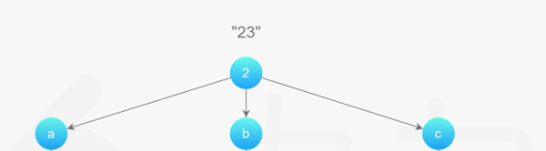
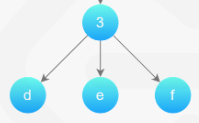
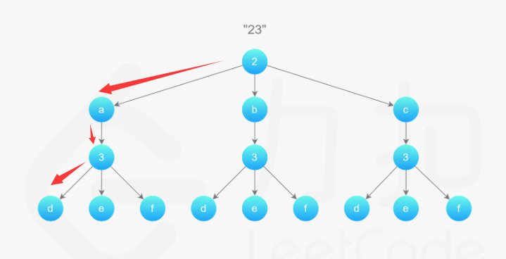
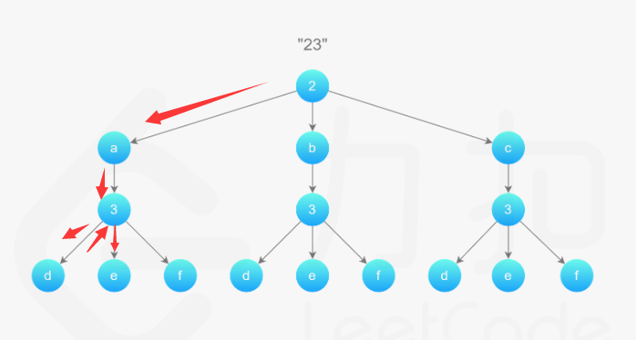

# Solution

根据题目分析，可以使用回溯算法解决。

首先，“23”这个组合，数字2对应了abc三个字母，因此

我们可以画出上面的图，2对应了下面的abc三个节点。

数字3对应了def三个字母，因此

那么当我们遍历2对应的子母时，当遍历到a时，
!a](2023-02-02-15-45-04.png)

他后面的数字是3，对应的def字母，我们挨个遍历，因此，首先我们遍历d

此时，我们可以看到，我们得到的字符串“ad”的长度和最开始给的digits长度是一致的，因此，这说明了我们此时已经得到了当前解。

然后我们继续遍历（需要回溯，但是go代码看不出来回溯的过程），从a=>e，因此得到了“ae”

同理可得“af”

然后当a后面的的数字遍历完了之后，数字2对应的abc三个数字还剩下2个，因此，我们继续遍历b，然后按照上面的流程继续遍历，依次得到“bd”，“be”，“bf”

c的遍历同理。

至此，我们就穷举出了全部的解（这道题不存在不可行的解）。
